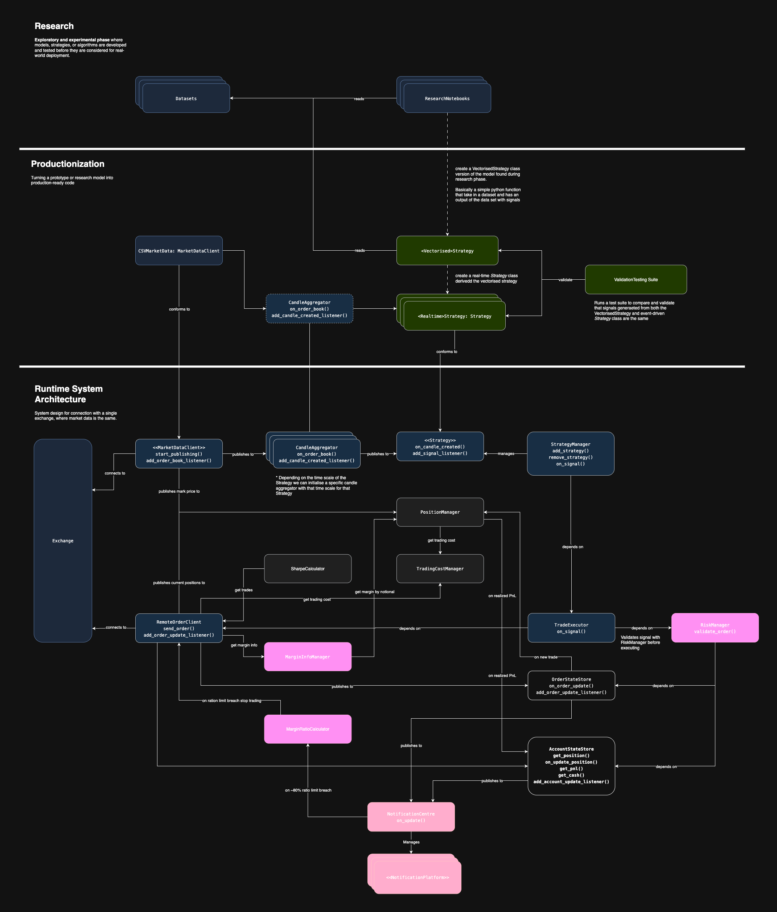

# 🧠  Real-Time Cryptocurrency Trading Bot Using SMA Strategy on BTC Futures 

This repository implements a modular framework for researching and deploying quantitative trading strategies in real-time environments. The design separates **research**, **productionization**, and **runtime system architecture** into clearly defined layers.

---

## 🏗️ Project Structure

Below is the updated architecture of the codebase:



*This diagram illustrates the flow from strategy research to event-driven integration and validation.*

---

## ⚡ How to Run

### Gateway
Add the keys in the `gateways/binance/vault/binance_keys` file
Run the `run_binance.py`
### Engine
Add the telegram keys in `engine/vault/telegram_keys`
Run the `main.py`
### Run in Windows
Execute the `run.bat`

---

## 🧪 Research

Exploratory and experimental phase where strategies are initially tested in a vectorized notebook format using historical data.

### Components
- `research/datasets/`: Raw historical price/time-series data
- `research/`: Strategy prototyping and analysis

---

## 🚀 Productionization (Model Integration)

Bridges research models into real-time production-ready event-driven strategies.

### Steps
1. Implement a class that inherits from the base `Strategy` and wraps vectorized logic.
2. Use `MarketDataClient` and `CandleAggregator` to simulate or stream tick-level market data.
3. Compare vectorized vs real-time strategy signals via the `ValidationTestingSuite ~ model_integration/tests`.

---

## ⚙️ Runtime System Architecture

System design for executing trades in a live setting using real-time data and event streams.

### Data Flow
```
Exchange
  ↓
MarketDataClient (e.g. CCXT, RemoteFeed)
  ↓
CandleAggregator → MidPriceCandle → Strategy
  ↓
→ StrategyManager → on_signal()
  ↓
→ TradeExecutor → RiskManager.validate_order()
  ↓
→ OrderExecutor → OrderStore
  ↓
→ AccountStateStore → MarginCalc → NotificationCenter
```

---

## 🧩 Key Components

| Component                | Description                                                                 |
|--------------------------|-----------------------------------------------------------------------------|
| **MarketDataClient**     | Streams raw order book data from an exchange.                              |
| **CandleAggregator**     | Constructs event-driven candles from raw ticks.                            |
| **Strategy**             | Real-time strategy class (e.g., `SMACrossoverInflectionStrategy`).         |
| **StrategyManager**      | Manages strategy lifecycle and dispatches signals.                         |
| **TradeExecutor**        | Listens to strategy signals and sends validated orders to executor.        |
| **RiskManager**          | Validates signals and orders against capital and risk rules.               |
| **OrderExecutor**        | Places or cancels orders through broker or mock client.                    |
| **OrderStore**           | Tracks live and historical orders.                                         |
| **AccountStateStore**    | Updates current positions, PnL, and available balance.                     |
| **MarginCalculator**     | Computes margin usage for active trades.                                   |
| **NotificationCenter**   | Pushes alerts to the notification platform.                                |

---

## ✅ Development Workflow

1. **Research** a new idea in notebooks using historical datasets.
2. **Productionize** the idea by wrapping logic in a real-time `Strategy` class.
3. Use the **Validation Suite** to ensure fidelity between vectorized and live logic.
4. Plug the new strategy into the **Runtime Engine** for simulation or live deployment.

---

